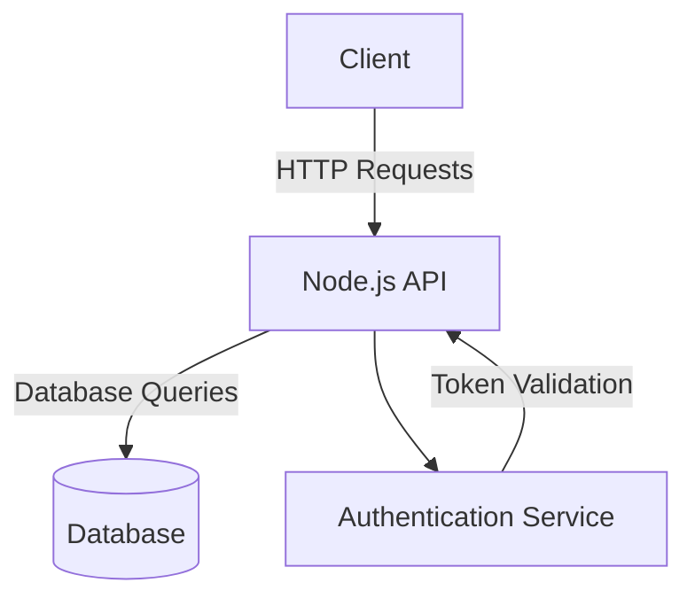
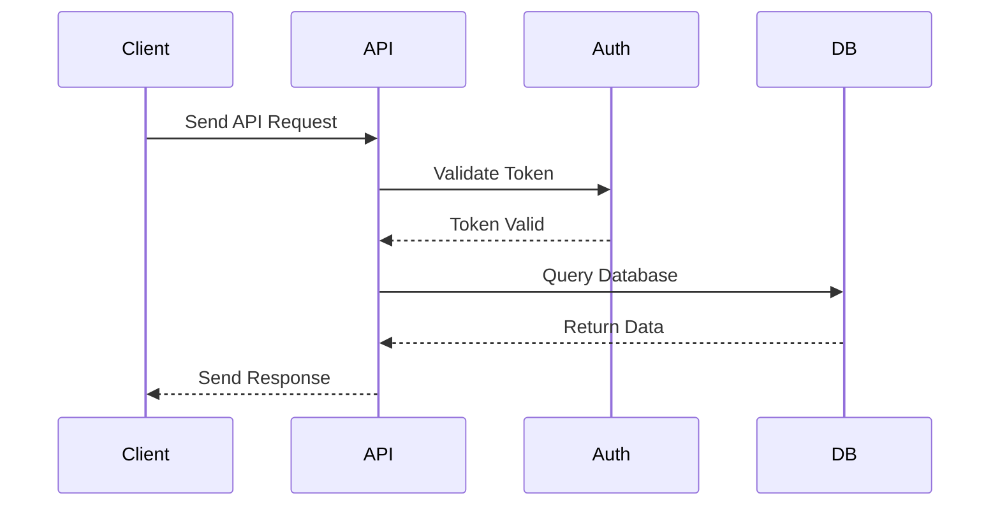

# Sample Node.js Application

This document provides an overview of a sample Node.js application, including its architecture and workflow. The document also includes mermaid diagrams to visualize the application's structure and processes.

## Application Overview

The sample Node.js application is a RESTful API that allows users to manage a collection of items. It includes the following features:
- Create, read, update, and delete (CRUD) operations.
- Authentication and authorization.
- Integration with a database for persistent storage.

## Architecture Diagram

The following diagram illustrates the high-level architecture of the application:



## Workflow Diagram

The following diagram shows the workflow for a typical API request:



## Getting Started

To run the sample application, follow these steps:

1. Clone the repository:
   ```bash
   git clone https://github.com/your-repo/sample-nodejs-app.git
   cd sample-nodejs-app
   ```

2. Install dependencies:
   ```bash
   npm install
   ```

3. Start the application:
   ```bash
   npm start
   ```

4. Access the API at `http://localhost:3000`.

## Reference Links

- [Node.js Documentation](https://nodejs.org/en/docs/)
- [Express.js Guide](https://expressjs.com/)
- [Mermaid Documentation](https://mermaid-js.github.io/mermaid/#/)
